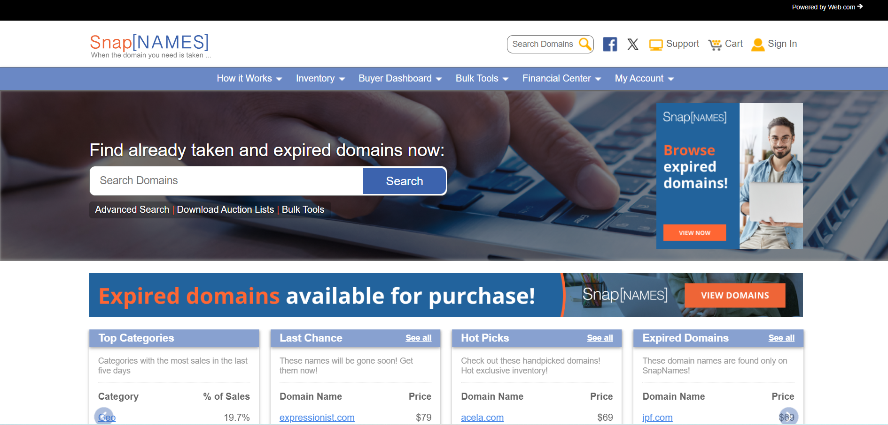

Domain names require annual renewal fees. When domain registrants fail to pay these fees, their domains expire and enter a “grace period” before being deleted by the central registry.

Among the thousands of domain names deleted daily are valuable assets quickly captured by automated systems. To beat this competition, you need a more powerful tool—and that’s where SnapNames comes in. 

As an industry pioneer, our advanced technology is designed to give you the edge in acquiring the ideal domain name for your next big idea as soon as it becomes available.

## What's the Cost?
We charge $69 for each domain name we successfuly register. However, this is only applicable if we successfully acquire the domain on its drop date.

## How to Get Started

To get started, it's important to understand the [backorder](https://curious-druid-05e915.netlify.app/backorders/) process, which allows you to reserve a domain name as it becomes available, and how to place one with us.

   

**_NOTE: This sample documentation project is not associated with SnapNames/Web.com, LLC._** 
   
